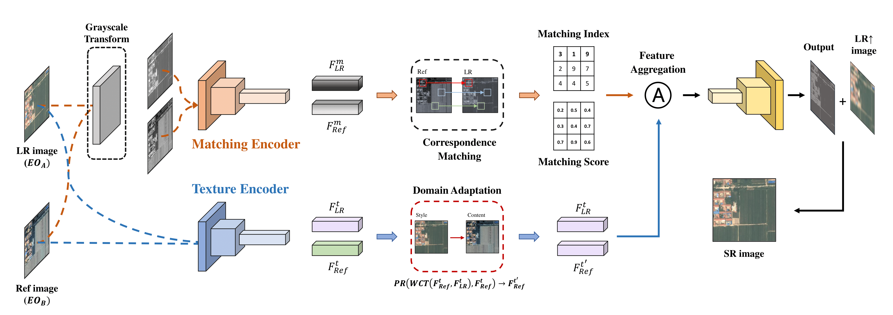

# Official implementation of "Bridging the Domain Gap: A Simple Domain Matching Method for Reference-based Image Super-Resolution in Remote Sensing (GRSL 2023)"

Official implementation of "Bridging the Domain Gap: A Simple Domain Matching Method for Reference-based Image Super-Resolution in Remote Sensing (GRSL 2023)"
[Paper](https://arxiv.org/pdf/2401.15944.pdf) | [Project Page](#)
## Overview
We propose a simple but effective domain matching method for reference-based image super-resolution (RefSR) that works well even when there is a large domain gap between input and reference images. Our method consists of three key components:

1. Gray Matching - Reduces domain gap in correspondence matching
2. Whitening and Coloring Transform (WCT) - Aligns feature distributions 
3. Phase Replacement (PR) - Preserves structural information



## Features
- Plug-and-play domain matching modules for existing RefSR models
- No additional training required
- Significant performance improvements on real-world remote sensing data
- Easy integration with SOTA RefSR models like C2-Matching, AMSA, and DATSR

## Installation

```bash
git clone https://github.com/username/domain-matching-refsr.git
cd domain-matching-refsr
pip install -r requirements.txt
```

## Dataset
We use the RRSSRD dataset which contains paired electro-optical satellite images:
- HR images: Gaofen-2, WorldView, Microsoft Virtual Earth 2018
- Reference images: Google Earth
- 4,047 training pairs (480×480)

## Usage

```python
# Example usage with DATSR model
from models.datsr import DATSR
from models.domain_matching import DomainMatching

# Initialize models
datsr = DATSR()
dm = DomainMatching()

# Load images
lr = load_image('lr.png')
ref = load_image('ref.png')

# Apply domain matching
lr_gray, ref_gray = dm.gray_matching(lr, ref)
matched_features = dm.wct_matching(lr_gray, ref_gray)
sr = datsr(lr, matched_features)
```

## Results

### Quantitative Results on RRSSRD Test Set

| Method | Params | 1st test set | 2nd test set | 3rd test set | 4th test set |
|--------|---------|--------------|--------------|--------------|--------------|
|        |         | PSNR/SSIM    | PSNR/SSIM    | PSNR/SSIM    | PSNR/SSIM    |
| C2-Matching | 8.9M | 34.05/0.891 | 33.13/0.860 | 31.19/0.827 | 33.37/0.847 |
| + Proposed |     | +0.03/+0.000 | +0.10/+0.001 | +0.14/+0.003 | +0.12/+0.001 |
| AMSA | 9.7M | 34.12/0.891 | 33.16/0.860 | 31.24/0.828 | 33.43/0.847 |
| + Proposed |     | +0.04/+0.001 | +0.05/+0.001 | +0.07/+0.002 | +0.07/+0.002 |
| DATSR | 18.9M | 33.98/0.890 | 33.03/0.858 | 31.13/0.826 | 32.28/0.845 |
| + Proposed |     | +0.12/+0.001 | +0.16/+0.003 | +0.18/+0.003 | +0.16/+0.002 |


## Contact
For any questions, please contact the authors:
- Jeongho Min (jeongho.min@unist.ac.kr)
- Jaejun Yoo (jaejun.yoo@unist.ac.kr)

## Citation
If you find this work useful for your research, please cite our paper:
```bibtex
@article{min2023bridging,
  title={Bridging the Domain Gap: A Simple Domain Matching Method for Reference-based Image Super-Resolution in Remote Sensing},
  author={Min, Jeongho and Lee, Yejun and Kim, Dongyoung and Yoo, Jaejun},
  journal={IEEE Geoscience and Remote Sensing Letters},
  year={2023},
  publisher={IEEE}
}
@article{min2024bridging,
  title={Bridging the Domain Gap: A Simple Domain Matching Method for Reference-based Image Super-Resolution in Remote Sensing},
  author={Min, Jeongho and Lee, Yejun and Kim, Dongyoung and Yoo, Jaejun},
  journal={arXiv preprint arXiv:2401.15944},
  year={2024}
}
```

## Acknowledgements
This work was supported by KRIT, NRF Korea, and IITP grants.
